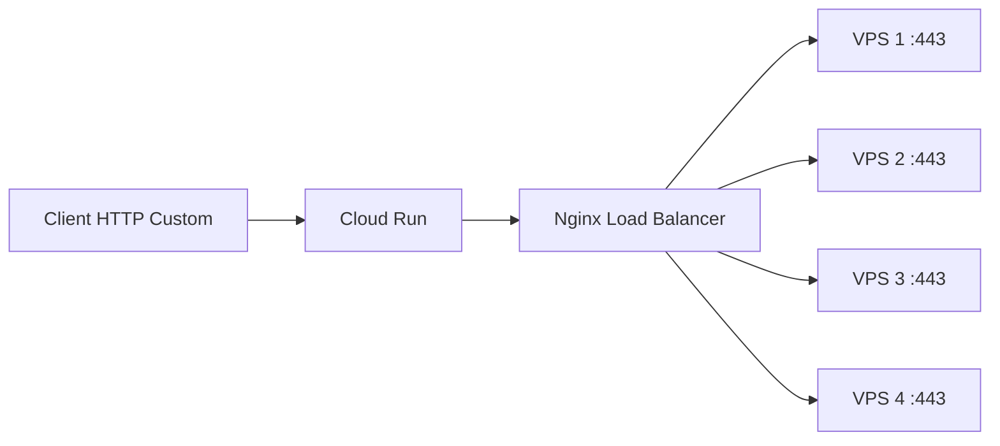

```markdown
<div align="center">
  
# 🚀 PROXY WEBSOCKET CLOUD RUN

### Load Balancing Multi-VPS | High Performance | Auto-scaling

[](https://cloud.google.com/run)
[](LICENSE)
[]()

</div>

---

## 📋 **Table des matières**
- [Architecture](#-architecture)
- [Fonctionnalités](#-fonctionnalités)
- [Prérequis](#-prérequis)
- [Configuration](#-configuration)
- [Déploiement](#-déploiement)
- [Variables d'environnement](#-variables-denvironnement)
- [Commandes utiles](#-commandes-utiles)
- [Dépannage](#-dépannage)
- [Auteur](#-auteur)

---

## 🏗️ **Architecture**



```
┌─────────────────────────────────────────────────────────────────┐
│                         CLOUD RUN                               │
│  ┌─────────────┐    ┌─────────────┐    ┌─────────────────────┐  │
│  │  proxy3.js  │ →  │   nginx     │ →  │  VPS1, VPS2, VPS3   │  │
│  │ (WebSocket) │    │(Load Balancer)│  │     (Backends)      │  │
│  └─────────────┘    └─────────────┘    └─────────────────────┘  │
└─────────────────────────────────────────────────────────────────┘
```

---

⚡ Fonctionnalités

Fonctionnalité Description
🌐 WebSocket Proxy Tunnel WebSocket haute performance
🔄 Load Balancing Répartition automatique round-robin
📡 Support UDP Intégration badvpn-udpgw
🔐 Serveur SSH Dropbear intégré
📱 HTTP Custom Ready Payload compatible
💰 Économies Min instances = 0, payez à l'usage
🚀 Auto-scaling Scale de 0 à 2 instances

---

📦 Prérequis

Élément Version
Compte Google Cloud Actif avec facturation
gcloud CLI Dernière version
Git 2.x+
Docker 20.x+ (optionnel)

---

🛠️ Configuration

1. Ajouter vos VPS dans nginx.conf

```nginx
stream {
    upstream backend {
        server VOTRE_VPS_1:443 max_fails=3;
        server VOTRE_VPS_2:443 max_fails=3;
        server VOTRE_VPS_3:443 max_fails=3;
        server VOTRE_VPS_4:443 max_fails=3;
    }
}
```

2. Options de load balancing

Algorithme Configuration Utilisation
Round-robin server ip:port; ✅ Par défaut
Least connections least_conn; Charge minimale
IP Hash ip_hash; Sticky sessions
